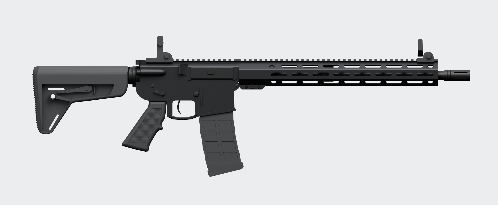

# weapon_ar15 — model 3D

Model 3D karabinka w układzie AR-15 odtworzony na podstawie zdjęcia referencyjnego i specyfikacji:
lufa 16,1", wolnopływające łoże 15" M-LOK z szyną Picatinny, kolba typu MOE SL (6 pozycji),
chwyt A2, polimerowy magazynek 30-nabojowy, składane przyrządy celownicze, tłumik płomienia A2.

**Bez oznaczeń producenta** — model nie zawiera żadnych napisów, logotypów, numerów seryjnych
ani oznaczeń bezpiecznika. Wszystkie nazwy obiektów są generyczne (`weapon_ar15`, `ar15_*`).



## Pliki

| Plik | Opis |
|---|---|
| `weapon_ar15.blend` | scena Blendera (kolekcja `weapon_ar15`, 36 siatek + 6 socketów) |
| `export/weapon_ar15.glb` | eksport glTF 2.0 (hierarchia, materiały, UV) |
| `export/weapon_ar15.fbx` | eksport FBX (hierarchia, materiały, UV, właściwości) |
| `renders/*.png` | rendery podglądowe (Cycles) |
| `blender/*.py` | generator — model jest w całości budowany skryptem, więc każdą poprawkę można odtworzyć |

## Wymiary (skala 1:1, 1 jednostka Blendera = 1 m)

| Parametr | Specyfikacja | Model |
|---|---|---|
| Długość całkowita, kolba złożona | 33" (838,2 mm) | **838,2 mm** |
| Długość całkowita, kolba rozłożona | 36,2" (919,4 mm) | **919,4 mm** (kolba przesuwa się o 81,2 mm, 6 pozycji) |
| Długość lufy (od czoła zamka do wylotu) | 16,1" (408,9 mm) | **408,9 mm** |
| Długość łoża | 15" (381 mm) | **381,0 mm** |
| Układ gazowy | carbine, DI | port gazowy 177,8 mm (7") od czoła zamka |
| Kaliber / skok gwintu | 5,56×45 mm NATO, 1:7 RH | przewód Ø 5,7 mm (właściwości na obiekcie głównym) |
| Szerokość / wysokość | — | 51 mm / 272 mm (z magazynkiem i przyrządami) |
| Masa | 3,0 kg | właściwość `mass_kg` na obiekcie `weapon_ar15` |

Proporcje sylwetki zostały zdjęte ze zdjęcia referencyjnego (skala 0,7945 mm/px, skalibrowana na
długość 33"), a render z boku pokrywa się ze zdjęciem 1:1.

## Układ współrzędnych

- **+X** w stronę wylotu lufy, **+Z** w górę, **+Y** lewa strona broni (okno wyrzutowe jest po stronie −Y).
- **Punkt (0, 0, 0)**: oś przewodu lufy × przednia płaszczyzna komory zamkowej górnej.
- Eksport GLB jest w konwencji glTF (+Y w górę); FBX zapisany z domyślnymi osiami Blendera.
  Orientację pod konkretny silnik ustawimy w kolejnym kroku.

## Hierarchia i punkty obrotu (pod animacje)

```
weapon_ar15                       (empty, root)
└─ ar15_lower_receiver
   ├─ ar15_upper_receiver         pivot: przedni bolec (upper odchyla się jak w prawdziwej broni)
   │  ├─ ar15_bolt_carrier        suwadło z zamkiem, pivot na tyle (ruch po −X)
   │  ├─ ar15_charging_handle     rączka napinacza (ruch po −X)
   │  ├─ ar15_dust_cover          pokrywa okna wyrzutowego, pivot na osi zawiasu
   │  ├─ ar15_forward_assist
   │  ├─ ar15_rear_sight_base → ar15_rear_sight_leaf     pivot osi składania
   │  ├─ ar15_barrel → barrel_nut, gas_block, gas_tube, crush_washer, flash_hider
   │  └─ ar15_handguard → handguard_hardware, front_sight_base → front_sight_leaf
   ├─ ar15_trigger                pivot: oś spustu
   ├─ ar15_trigger_guard, ar15_selector (pivot: oś), ar15_mag_release, ar15_bolt_catch, ar15_pins
   ├─ ar15_pistol_grip
   ├─ ar15_buffer_tube → castle_nut, end_plate, stock → buttpad, stock_lever, stock_qd
   │                                   (stock: pivot z przodu kolby, przesuw 81,2 mm po −X)
   └─ ar15_magazine → magazine_lips, cartridge_case, cartridge_bullet
```

Sockety (empty) dla silnika: `socket_muzzle`, `socket_shell_eject`, `socket_grip`,
`socket_sight_rear`, `socket_sight_front`, `socket_magazine`.

## Siatka i materiały

- ~113 tys. trójkątów, 36 obiektów, fazowane krawędzie + weighted normals, automatyczne UV
  (Smart UV Project).
- To jest model źródłowy (high-poly). Pod **FiveM / GTA V** zrobimy z niego wersję game-ready
  (niska siatka + bake normal map, tekstury, eksport `.ydr`) — po akceptacji kształtu.
- Materiały PBR: `ar15_aluminum_anodized`, `ar15_steel_phosphate`, `ar15_polymer`,
  `ar15_polymer_checkered` (radełkowanie chwytu jako proceduralny bump), `ar15_rubber`,
  `ar15_brass`, `ar15_copper`.

## Odtworzenie modelu

```bash
pip install bpy shapely          # Blender 5.0 jako moduł Pythona
python3 blender/build_weapon_ar15.py --save --export
python3 blender/render_final.py 128             # rendery do renders/
```

lub w zainstalowanym Blenderze: `blender -b -P blender/build_weapon_ar15.py -- --save --export`.
