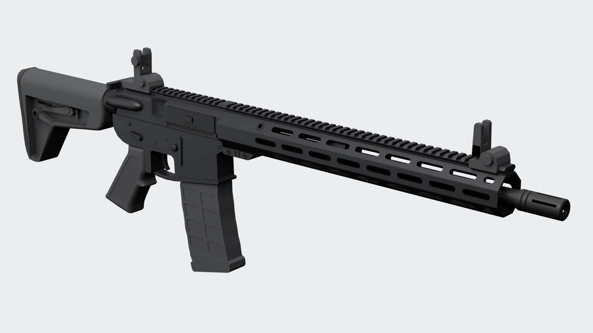
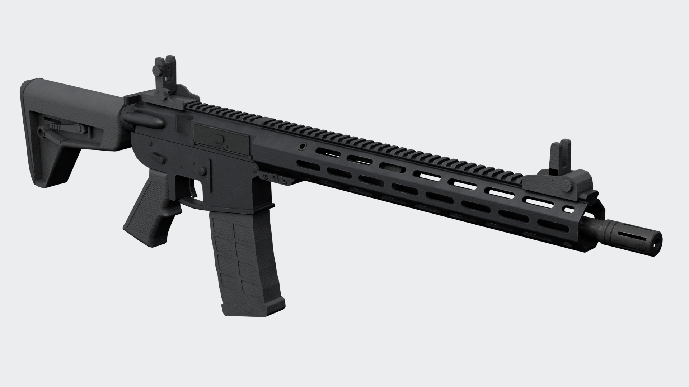
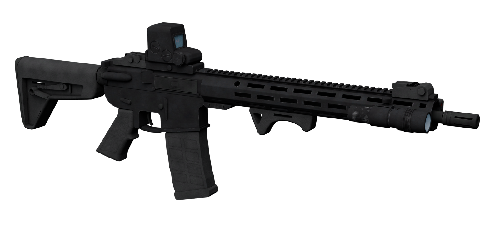
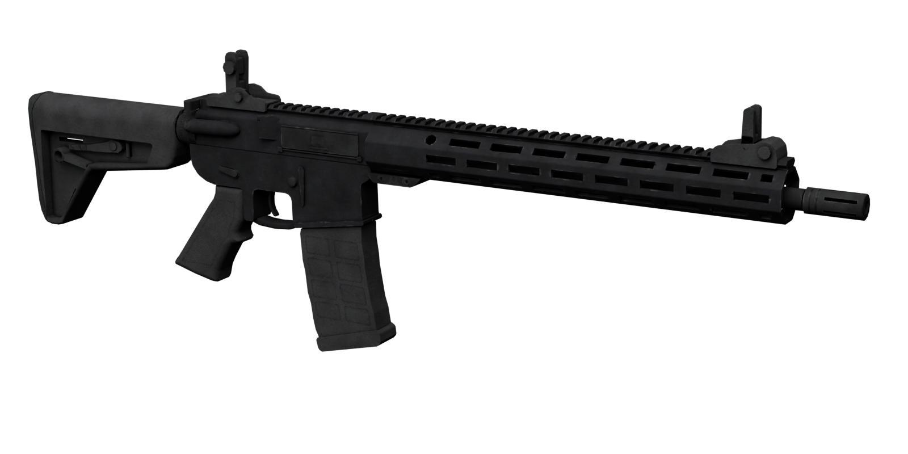
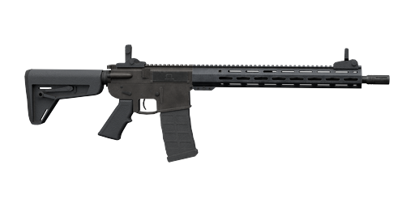
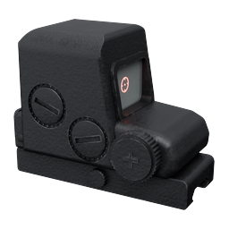
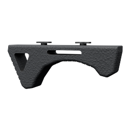
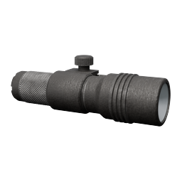
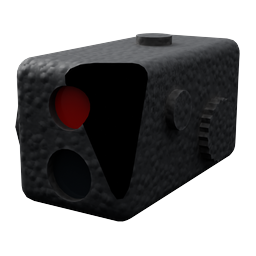

# weapon_ar15 — model 3D

Model 3D karabinka w układzie AR-15 odtworzony na podstawie zdjęcia referencyjnego i specyfikacji:
lufa 16,1", wolnopływające łoże 15" M-LOK z szyną Picatinny, kolba typu MOE SL (6 pozycji),
chwyt A2, polimerowy magazynek 30-nabojowy, składane przyrządy celownicze, tłumik płomienia A2.

**Bez oznaczeń producenta** — model nie zawiera żadnych napisów, logotypów, numerów seryjnych
ani oznaczeń bezpiecznika. Wszystkie nazwy obiektów są generyczne (`weapon_ar15`, `ar15_*`).





## Pliki

| Plik | Opis |
|---|---|
| `weapon_ar15.blend` | scena Blendera (kolekcja `weapon_ar15`: broń, 4 dodatki, sockety) |
| `export/weapon_ar15.glb` | eksport glTF 2.0 (hierarchia, tekstury PBR, dodatki) |
| `export/weapon_ar15.fbx` | eksport FBX (hierarchia, UV, tekstury z `textures/`, właściwości) |
| `textures/*.png` | atlasy tekstur (broń 2048, dodatki 2048) |
| `renders/*.png` | rendery podglądowe (Cycles) |
| `weapon_ar15_game.blend` | **wersja do gry**: 9 804 trójkątów ze wszystkimi dodatkami, szkielet, 9 animacji |
| `export/game/weapon_ar15_game.{glb,fbx}` | eksport wersji do gry z animacjami |
| `textures/game/*.png` | wypieczone tekstury PBR wersji do gry (broń 2048, dodatki 1024) |
| `fivem/weapon_ar15/` | **gotowy zasób FiveM** (`.ydr`/`.ytd`, pliki meta, `client.lua`) |
| `fivem/ox_inventory/` | `weapons_ar15.lua` (wpisy do `ox_inventory/data/weapons.lua`) + ikony przedmiotów |
| `fivem/tools/` | generator `weaponanimations.meta` (PowerShell i Python) |
| `fivem/weapon_ar15_sollumz.blend` | scena Sollumz (do edycji i ponownego eksportu), tekstury z `textures/fivem/` |
| `tools/cwconv/` | konwerter CodeWalker XML ↔ `.ydr`/`.ytd` (na CodeWalker.Core) |
| `blender/*.py` | generator — model jest w całości budowany skryptem, więc każdą poprawkę można odtworzyć |

## Wymiary (skala 1:1, 1 jednostka Blendera = 1 m)

| Parametr | Specyfikacja | Model |
|---|---|---|
| Długość całkowita, kolba złożona | 33" (838,2 mm) | **838,2 mm** |
| Długość całkowita, kolba rozłożona | 36,2" (919,4 mm) | **919,4 mm** (kolba przesuwa się o 81,2 mm, 6 pozycji) |
| Długość lufy (od czoła zamka do wylotu) | 16,1" (408,9 mm) | **408,9 mm** |
| Długość łoża | 15" (381 mm) | **381,0 mm** |
| Układ gazowy | carbine, DI | port gazowy 177,8 mm (7") od czoła zamka |
| Kaliber / skok gwintu | 5,56×45 mm NATO, 1:7 RH | przewód Ø 5,7 mm (właściwości na obiekcie głównym) |
| Szerokość / wysokość | — | 51 mm / 272 mm (z magazynkiem i przyrządami) |
| Masa | 3,0 kg | właściwość `mass_kg` na obiekcie `weapon_ar15` |

Proporcje sylwetki zostały zdjęte ze zdjęcia referencyjnego (skala 0,7945 mm/px, skalibrowana na
długość 33"), a render z boku pokrywa się ze zdjęciem 1:1.

## Układ współrzędnych

- **+X** w stronę wylotu lufy, **+Z** w górę, **+Y** lewa strona broni (okno wyrzutowe jest po stronie −Y).
- **Punkt (0, 0, 0)**: oś przewodu lufy × przednia płaszczyzna komory zamkowej górnej.
- Eksport GLB jest w konwencji glTF (+Y w górę); FBX zapisany z domyślnymi osiami Blendera.
- GTA V używa tych samych osi (lufa +X, góra +Z, prawa strona −Y), więc pliki `.ydr` nie mają
  żadnych dodatkowych obrotów.

## Dodatki

Wszystkie dodatki są generyczne (bez nazw i logo producentów) i siedzą w osobnych obiektach-rodzicach,
więc można je eksportować jako osobne komponenty broni:

| Obiekt | Dodatek | Mocowanie |
|---|---|---|
| `ar15_att_holo` | celownik holograficzny typu „box” 96,5 × 58,4 × 73,7 mm: okno z osłoną, pojemnik baterii z radełkowaną nakrętką, 2 pokrętła regulacji, 2 przyciski, montaż z dźwignią; szkło + podświetlany pierścień z kropką | szyna Picatinny komory górnej, `socket_att_scope` |
| `ar15_att_foregrip` | chwyt przedni kątowy: wysoka stopka z trójkątnym oknem z tyłu (od strony magazynka), ryflowany skos i niski ogranicznik z przodu | dwa dolne sloty M-LOK, `socket_att_grip` |
| `ar15_att_flashlight` | latarka taktyczna na szynę, dł. 117,9 mm: głowica Ø 32,2 mm z 4 żebrami (Ø 34,2), korpus Ø 26,5, pierścień zatrzasku Ø 29,4 z radełkowanym pokrętłem Ø 14,5, radełkowany uchwyt Ø 25, nasadka z koronką i gumowym włącznikiem; w środku odbłyśnik, LED i szybka | prawy bok łoża: krótka szyna Picatinny (45 mm) na slocie M-LOK, `socket_att_flashlight` |
| `ar15_att_laser` | moduł laserowy (laser + okno IR) | lewy slot M-LOK, `socket_att_laser` |

Przy założonym celowniku przyrządy mechaniczne są złożone jak w prawdziwej broni: tylny przeziernik
składa się do przodu (+90° wokół osi Y), muszka do tyłu (−90°) — obie mają pivot na osi zawiasu i
wnękę w podstawie, w którą chowają się po złożeniu. Punkty emisji: `socket_light_emit`, `socket_laser_emit`.

## Tekstury

Wypiekane (bake) atlasy PBR w `textures/`:

| Atlas | Rozdzielczość | Mapy |
|---|---|---|
| `ar15_weapon_*` | 2048 × 2048 | `basecolor` (z AO), `orm` (R = AO, G = roughness, B = metallic), `normal` (OpenGL) |
| `ar15_attachments_*` | 2048 × 2048 | jak wyżej |

Wygląd jest dobrany do broni z GTA V (w stylu Carbine Rifle, bez żadnych napisów): komora w ciepłym,
ciemnym grafitowym anodowaniu, łoże w chłodniejszym odcieniu, fosforanowana stal, czarny polimer ze
stipplem, niklowane suwadło widoczne w oknie wyrzutowym. Na krawędziach jasne przetarcia do gołego
metalu, w zagłębieniach kurz i AO, do tego rysy w pojedynczych miejscach i radełkowanie chwytu.
Receptury materiałów są w `blender/texture_bake.py` (`RECIPES`, `PART_RECIPE`), a materiały
proceduralne (`*__detail`) zostają w pliku .blend, więc bake można powtórzyć skryptem.

## Hierarchia i punkty obrotu (pod animacje)

```
weapon_ar15                       (empty, root)
└─ ar15_lower_receiver
   ├─ ar15_upper_receiver         pivot: przedni bolec (upper odchyla się jak w prawdziwej broni)
   │  ├─ ar15_bolt_carrier        suwadło z zamkiem, pivot na tyle (ruch po −X)
   │  ├─ ar15_charging_handle     rączka napinacza (ruch po −X)
   │  ├─ ar15_dust_cover          pokrywa okna wyrzutowego, pivot na osi zawiasu
   │  ├─ ar15_forward_assist
   │  ├─ ar15_rear_sight_base → ar15_rear_sight_leaf     pivot osi składania
   │  ├─ ar15_barrel → barrel_nut, gas_block, gas_tube, crush_washer, flash_hider
   │  └─ ar15_handguard → handguard_hardware, front_sight_base → front_sight_leaf
   ├─ ar15_trigger                pivot: oś spustu
   ├─ ar15_trigger_guard, ar15_selector (pivot: oś), ar15_mag_release, ar15_bolt_catch, ar15_pins
   ├─ ar15_pistol_grip
   ├─ ar15_buffer_tube → castle_nut, end_plate, stock → buttpad, stock_lever, stock_qd
   │                                   (stock: pivot z przodu kolby, przesuw 81,2 mm po −X)
   └─ ar15_magazine → magazine_lips, cartridge_case, cartridge_bullet
```

Sockety (empty) dla silnika: `socket_muzzle`, `socket_shell_eject`, `socket_grip`,
`socket_sight_rear`, `socket_sight_front`, `socket_magazine`, oraz dla dodatków
`socket_att_scope`, `socket_att_grip`, `socket_att_flashlight`, `socket_att_laser`,
`socket_light_emit`, `socket_laser_emit`.

## Siatka i materiały

- Broń ~114 tys. trójkątów (36 obiektów) + dodatki ~48 tys.; fazowane krawędzie + weighted normals.
- To jest model źródłowy (high-poly). Wersja do gry jest opisana niżej.
- Materiały PBR: `ar15_aluminum_anodized`, `ar15_steel_phosphate`, `ar15_polymer`,
  `ar15_polymer_checkered` (radełkowanie chwytu jako proceduralny bump), `ar15_rubber`,
  `ar15_brass`, `ar15_copper`.

## Wersja do gry (FiveM / GTA V)

Siatka jest budowana tymi samymi skryptami w trybie niskiego detalu, a cały detal high-poly
(fazowania, radełkowanie, śruby, faktury, przetarcia) jest wypiekany na mapy normal/kolor/ORM
wprost z materiałów proceduralnych high-poly (jedno próbkowanie, 16 próbek na piksel, więc tekstura
jest ostra i bez schodków). Tekstury do gry: broń 2048 px (kolor, normal) i 1024 px (spec),
dodatki 1024 px; cały `w_ar_ar15.ytd` ma 5,4 MB.

| Część | Trójkąty |
|---|---:|
| Broń (bez magazynka) | 7 016 |
| Magazynek | 468 |
| Celownik holograficzny | 802 |
| Chwyt przedni | 262 |
| Latarka | 944 |
| Laser | 312 |
| **Razem, wszystko założone** | **9 804** (limit 10 000) |

Szkielet (kości) i animacje w `weapon_ar15_game.blend` / `export/game/`: `fire`, `fire_auto`,
`fire_last` (zamek zostaje z tyłu), `reload`, `reload_empty` (zwolnienie zamka), `charge` (rączka
napinacza), `sights_fold`, `stock_extend`, `shell_eject` (łuska jako osobny model, 48 trójkątów).
Ruchome części mają własne kości: suwadło, rączka napinacza, spust, pokrywa okna wyrzutowego,
zatrzask zamka, zatrzask magazynka, bezpiecznik, kolba, przeziernik i muszka.



Ten render i dwa kolejne są zrobione z **gotowych plików `.ydr`/`.ytd`** (przekonwertowanych z
powrotem przez CodeWalker.Core i zaimportowanych Sollumzem), z dodatkami ustawionymi tak jak
ustawia je gra: początek modelu dodatku na kości mocowania broni.



## FiveM + ox_inventory

Broń jest przedmiotem `WEAPON_AR15`, a każdy dodatek osobnym przedmiotem ox_inventory:

| Przedmiot ox | Komponent GTA | Model | Mocowanie |
|---|---|---|---|
| `WEAPON_AR15` (AR-15, amunicja `ammo-rifle`) | — | `w_ar_ar15` | — |
| — (domyślny) | `COMPONENT_AR15_CLIP_01` (30 naboi) | `w_ar_ar15_mag1` | `WAPClip` |
| — (domyślny) | `COMPONENT_AR15_SIGHTS` (przyrządy rozłożone) | `w_ar_ar15_sights` | `WAPScop` |
| `at_ar15_holo` | `COMPONENT_AT_AR15_SCOPE_HOLO` | `w_at_ar15_holo` | `WAPScop` |
| `at_ar15_grip` | `COMPONENT_AT_AR15_AFGRIP` | `w_at_ar15_afgrip` | `WAPGrip` |
| `at_ar15_flashlight` | `COMPONENT_AT_AR15_FLSH` | `w_at_ar15_flsh` | `WAPFlshLasr` |
| `at_ar15_laser` | `COMPONENT_AT_AR15_LASER` | `w_at_ar15_laser` | `WAPSupp_2` |

|  |  |  |  |  |
|---|---|---|---|---|

**Składane przyrządy w grze:** rozłożone przyrządy są domyślnym komponentem na mocowaniu `WAPScop`.
Celownik holograficzny siedzi na tym samym mocowaniu, więc po założeniu zastępuje je, a model
celownika zawiera przyrządy złożone. Po zdjęciu celownika `client.lua` przywraca przyrządy rozłożone.

### Instalacja

1. Skopiuj `fivem/weapon_ar15` do `resources/` serwera.
2. Wygeneruj animacje (raz, ok. 1 min): w OpenIV lub CodeWalkerze wyeksportuj z gry
   `update\update.rpf\common\data\ai\weaponanimations.meta`, potem:
   ```
   powershell -ExecutionPolicy Bypass -File fivem\tools\make_weaponanimations.ps1 -Vanilla C:\sciezka\weaponanimations.meta
   ```
   (albo `python3 fivem/tools/make_weaponanimations.py <plik>`). Skrypt kopiuje wszystkie zestawy
   animacji `WEAPON_CARBINERIFLE` jako `WEAPON_AR15` i nadpisuje `meta/weaponanimations.meta`.
   Nazwy zestawów animacji pochodzą z plików gry, dlatego nie są wpisane na sztywno: zła nazwa
   potrafi wysypać klienta.
3. W `ox_inventory/data/weapons.lua` dopisz wpis z `Weapons` i cztery wpisy z `Components` z pliku
   `fivem/ox_inventory/weapons_ar15.lua` (nie podmieniaj całego pliku ox). Ikony z
   `fivem/ox_inventory/web/images/` skopiuj do `ox_inventory/web/images/`.
4. `server.cfg`: `ensure weapon_ar15` przed `ensure ox_inventory`.
5. Test: `/giveitem <id> WEAPON_AR15 1`, `/giveitem <id> ammo-rifle 120`,
   `/giveitem <id> at_ar15_holo 1` (i `at_ar15_grip`, `at_ar15_flashlight`, `at_ar15_laser`).
   Dodatek zakłada się, używając przedmiotu z bronią w ręku, a zdejmuje z menu broni w ekwipunku.

Latarka włącza się jak w każdej broni z latarką w GTA. Laser: klawisz **J** (FiveM → Ustawienia →
Klawisze → FiveM, „AR-15: laser wł./wył.”); promień widzą też inni gracze w promieniu 80 m.

### Co jest sprawdzone, a co wymaga testu w grze

- Sprawdzone tutaj: pliki `.ydr`/`.ytd` wczytują się w CodeWalker.Core i po imporcie do Blendera
  składają się poprawnie; wszystkie nazwy pól i flag w plikach meta istnieją w liście nazw metadanych
  gry (CodeWalker); składnia Lua; wpisy ox_inventory; build jest powtarzalny (identyczne sumy MD5).
- Do sprawdzenia w grze (nie da się tu uruchomić GTA): ułożenie broni w dłoni (kość `Gun_GripR`
  skopiowana z waniliowego karabinu), przesunięcia widoku z pierwszej osoby (`FirstPerson*` w
  `weapons.meta`), punkt świecenia latarki i mocowanie lasera na `WAPSupp_2`. Broń strzela tylko
  ogniem pojedynczym (bez flagi `Automatic`, najwyżej jeden strzał na 0,15 s). Wartości balansu
  (obrażenia 32, 30 naboi) to punkt wyjścia do własnych ustawień.
- Animacje z `weapon_ar15_game.blend` to animacje modelu (suwadło, pokrywa, magazynek). W grze postać
  używa animacji karabinka z gry, a błysk z lufy i wyrzut łusek to efekty GTA na kościach
  `Gun_Muzzle` i `Gun_VFX_Eject`. Kości ruchomych części są w `.ydr`, gotowe pod słownik animacji `.ycd`.

## Animacje postaci (do akceptacji)

`blender/ar15_anims.py` robi animacje na szkielecie peda GTA V (`blender/ped_rig.py`,
`blender/data_ped_skeleton.json`), z bronią trzymaną tak, jak trzyma ją gra (`Gun_GripR` na
`PH_R_Hand`). Klipy (30 kl./s): `hold` (trzymanie nisko przez klatkę, pętla 4 s), `reload` (2,0 s)
i `reload_empty` (2,4 s) w rytmie przeładowania Carbine Rifle z GTA V (magazynek wypada, nowy z pasa
przy lewym biodrze, na pusto uderzenie w zatrzask zamka), `fire` / `fire_last` dla samej broni oraz
`shot` / `empty` tylko do podglądu. Palce lewej dłoni zaciskają się na prawdziwej siatce broni
(`ped_anim.fit_fingers`). Podgląd: `python3 blender/ar15_anims.py --out <katalog>` zapisuje .blend,
glTF i zdarzenia (łuski, wypadnięcie magazynka) do `ar15_anims.json`.

## Odtworzenie modelu

```bash
pip install bpy shapely          # Blender 5.0 jako moduł Pythona
python3 blender/build_weapon_ar15.py --save     # geometria + dodatki
python3 blender/texture_bake.py 2048            # atlasy UV + bake tekstur
# szybka zmiana samych dodatków (broń zostaje z teksturami):
# python3 blender/update_attachments.py && python3 blender/texture_bake.py --only ar15_attachments
python3 blender/export_all.py                   # GLB + FBX z teksturami
python3 blender/render_final.py 96              # rendery do renders/
python3 blender/build_game.py                   # wersja do gry: siatka LOD, bake, szkielet, animacje
python3 blender/ar15_anims.py                   # animacje postaci (export/anims)
```

Pliki FiveM (Linux, bez Windowsa i bez GTA):

```bash
apt install imagemagick dotnet-sdk-8.0
pip install --pre szio==1.4.0.dev0
git clone https://github.com/Sollumz/Sollumz build/Sollumz        # testowane na f7fe616 (2.9.0-dev)
git clone https://github.com/dexyfex/CodeWalker build/CodeWalker   # testowane na 485d56b
dotnet build tools/cwconv -c Release -o build/cwconv
python3 blender/build_fivem.py --sollumz build/Sollumz --cwconv build/cwconv/cwconv
python3 blender/verify_fivem.py --sollumz build/Sollumz --cwconv build/cwconv/cwconv   # kontrola
python3 blender/render_icons.py                                    # ikony ox_inventory
```

lub w zainstalowanym Blenderze: `blender -b -P blender/build_weapon_ar15.py -- --save --export`.
